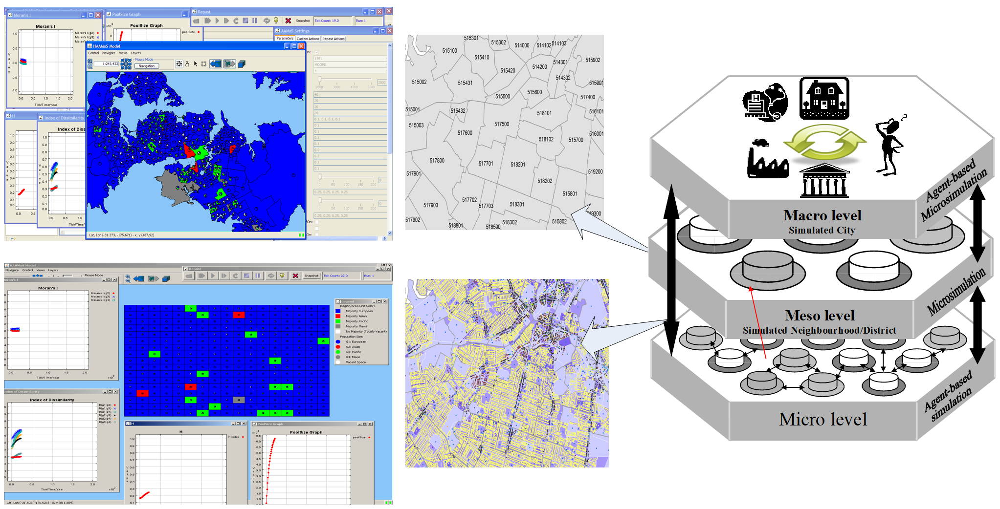

# Hybrid Agent‐based Microsimulation of Segregation (HAAMoS)

This is the code for the HAAMoS (Hybrid Agent‐based Microsimulation of Segregation) model.

HAAMoS is a data-driven, multifactor, multiscale, multi-measure agent-based microsimulation model for investigating various scenarios related to the effects of population mobility, housing vacancy, preference (behavior), and economic factors on ethnic residential segregation.



The model can be used within the limited range of functionalities described in the thesis titled  
```Using a Hybrid Model for Investigating Residential Segregation: An Empirical and Simulation-based Study```

Please note that the HAAMoS model was not initially developed with public usage in mind. 
At its current stage, it may not be user-friendly, and several features are still under development. 

Some concepts and features have been inherited and maintained from initial built prototypes, some of which may not be fully functional in the HAAMoS model. 

## Model Requirements

To install and run the HAAMoS model, you need to install the following three programs on your computer. 
You can install Java before installing Eclipse. 
The model was tested on the Windows operating system (both XP and 7), but it should also work on other platforms such as Mac OS and Linux, as long as you download and install the compatible versions of the following programs. 

Additionally, you may need to adjust the paths to specific files in the batch mode according to the syntax requirements of your operating system.

Please note that the compatibility and installation instructions may vary depending on your specific operating system and software versions. 

It's recommended to refer to the documentation or guidelines provided with each program for detailed installation and configuration instructions.

1)	Java SDK 1.5 or higher
2)	Eclipse 3.3 or higher
3)	RepastJ version 3.1

## Setting up Repast in Eclipse

To import a Repast project into Eclipse, follow these instructions:

1.	Open Eclipse
2.	Click File -> import 
3.	Select General -> Existing Projects into Workspace
4.	Click Next
5.	Click Browse (in front of Select root directory radio button) 
6.	Select the root directory of the Repast project from CD-ROM
7.	Select Copy projects into workspace 
8.	Click Finish

## Setting up HAAMoS in Eclipse

To import the HAAMoS project into Eclipse, follow these instructions:

1.	Open Eclipse (if not already)
2.	Click File -> import 
3.	Select General -> Existing Projects into Workspace
4.	Click Next
5.	Click Browse (in front of Select root directory radio button) 
6.	Select the root directory of HAAMoS project from CD-ROM
7.	Select Copy projects into workspace 
8.	Click Finish

## To run the HAAMoS model in Eclipse

    follow these steps:

    Initial Launch:
        If the launch configuration does not exist, select the HAAMoSModel.java file from the listing.
        Right-click on the file and choose "Run As > Java Application" from the pop-up menu.
        This will create a launch configuration item, allowing you to directly use the run button or menu in the future.

    Launch Configuration:
        Beside the run button in the Eclipse toolbar (green arrow resembling a VCR play button), locate a black arrow pointing down.
        Click on the black arrow and select the launch configuration "1 HAAMoSModel."

    Model Execution:
        Once the HAAMoS model is launched, you can utilize the model toolbar for execution.
        The model toolbar includes control buttons such as 'Load model', 'Multi-runs start', 'Start', 'Step', 'Initialize', 'Stop', 'Pause', 'Setup', and 'Exit'.
        Notably, the multi-runs function enables batch runs by loading a prewritten parameter file.

Additional Configuration (Batch Mode):

    Batch Mode Setting:
        If running the model in batch mode, ensure that the BatchMode parameter in the Const class is set to "true."
        If not running in batch mode, set it to "false" (BatchMode = false).

    Shapefile Configuration:
        In batch mode, correctly set the shapefile name and its path using the BatchModeFilenamePath parameter.

    Environment Settings:
        If using an artificial environment (e.g., Schelling or Fossett shapefile), set the DefaultRadiusSizeOfGroupPopIndicator parameter to 0.009f.
        For a more realistic mode, set it to 0.004 for better display results.

    Immigration Configuration:
        When immigration is used, set the FlowInImm parameter to a value greater than 0 in both batch and normal modes.

    Census-based Immigration:
        Set the CensusBasedFlowInImmigration parameter to either "true" or "false" based on your preference.
        If set to "true," the model will utilize census values and functions with census vacancy rates.
        If set to "false," you can specify your own value using the FlowInImm parameter.

Make sure to adjust these parameters in the Const class of the HAAMoS model to suit your desired settings and then execute the model accordingly.

## To increase the heap size for running simulations in Eclipse

follow these steps:

    Right-click on the HAAMoSModel.java file in the Eclipse Package Explorer to open the pop-up menu.

    From the pop-up menu, select "Run As" and then choose "Open Run Dialog..." option.

    This will open the Run Configurations dialog box.

    In the Run Configurations dialog box, locate the "VM arguments" section.

    In the VM arguments field, add the following argument to increase the maximum heap size:
    -Xmx<maximum heap size>

    For example, to set the maximum heap size to 600 Megabytes, use -Xmx600M.

    After setting the desired maximum heap size, click the "Apply" button to save the changes.

    Click the "Run" button to launch the simulation with the increased heap size.

By increasing the heap size, you allocate more memory to the Java runtime, which can help prevent Java "Out Of Memory Error" messages during the execution of scenarios.


## Next
...
